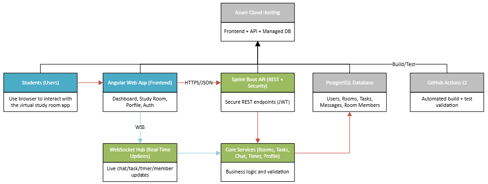
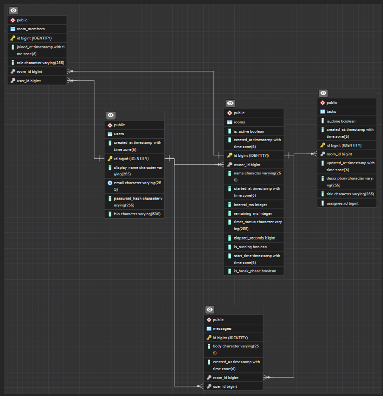
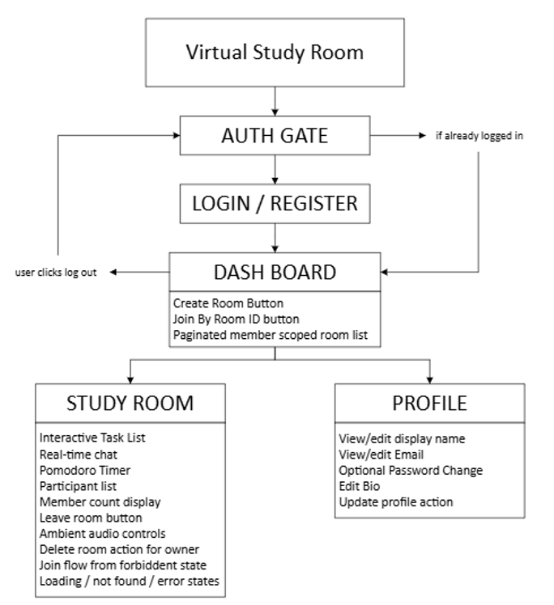
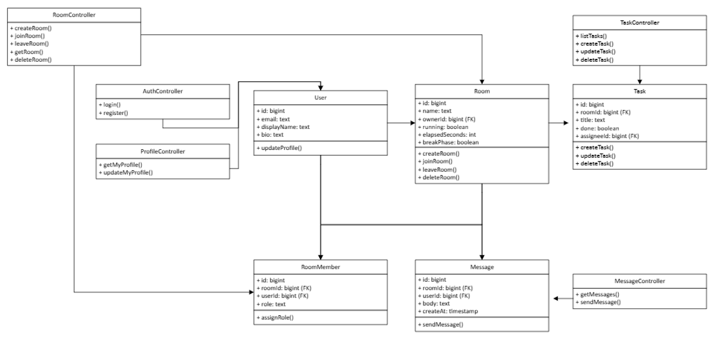
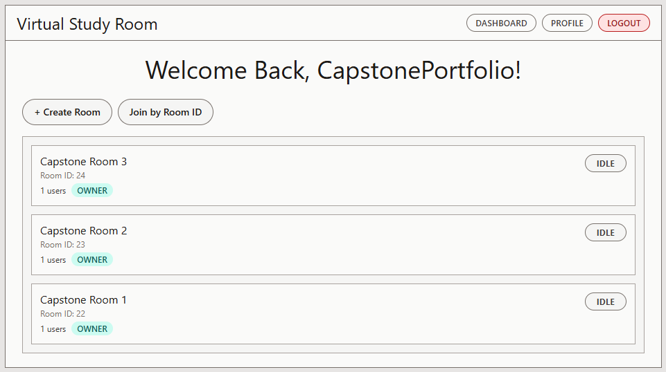
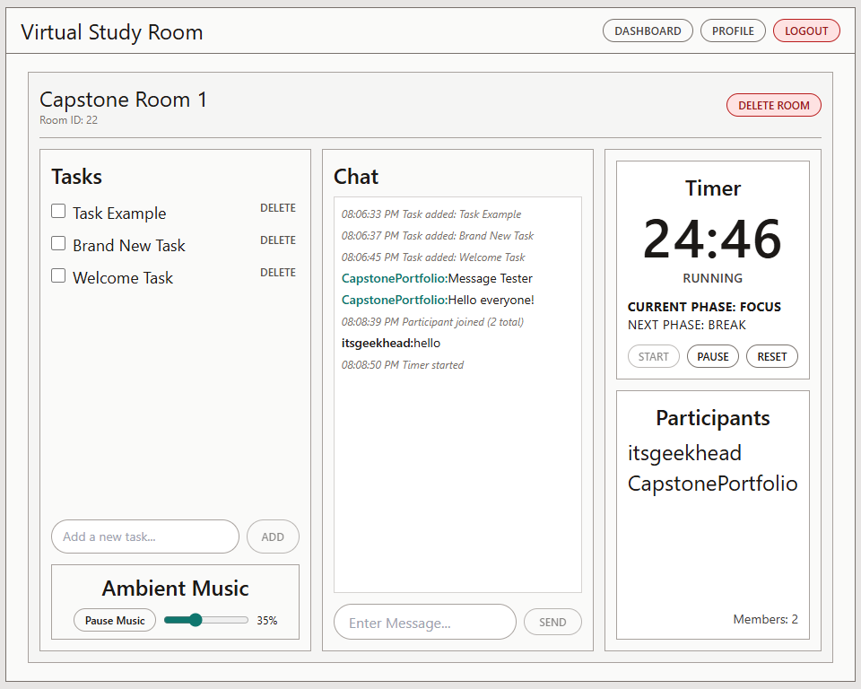
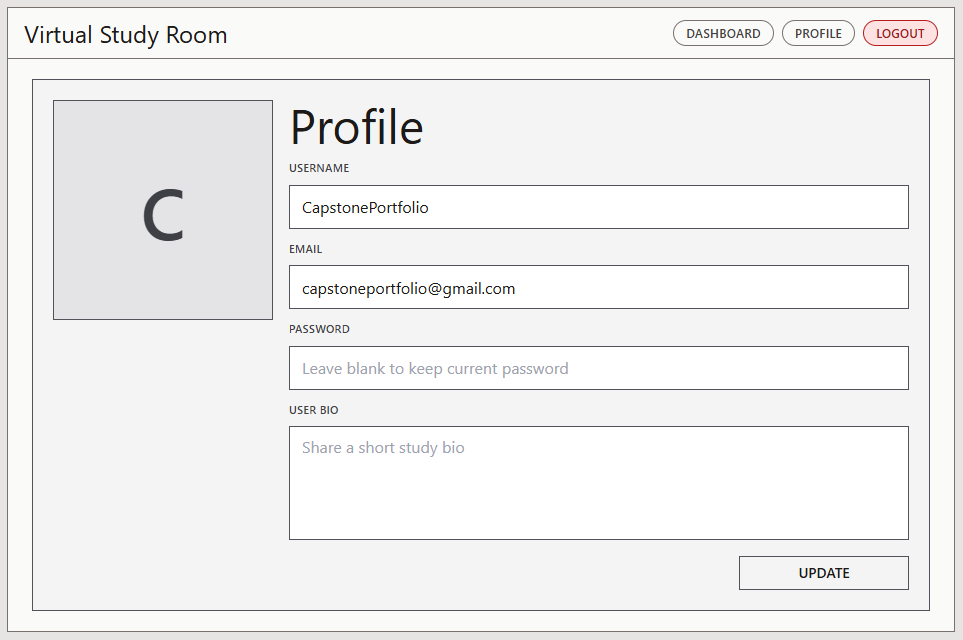
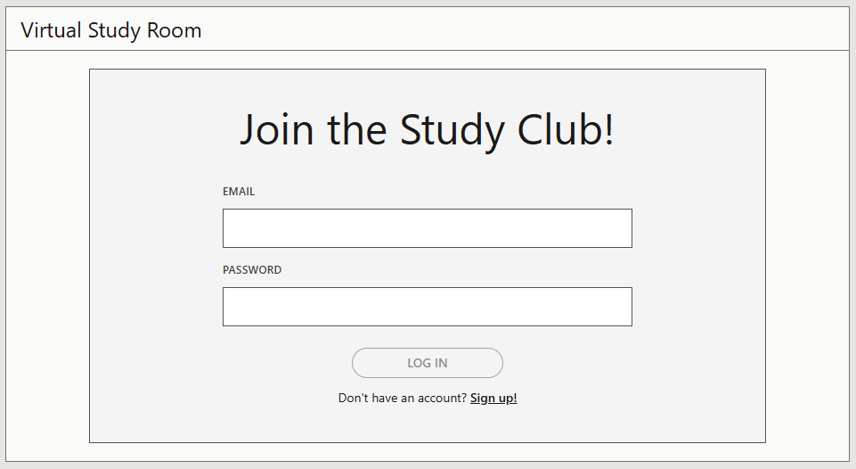
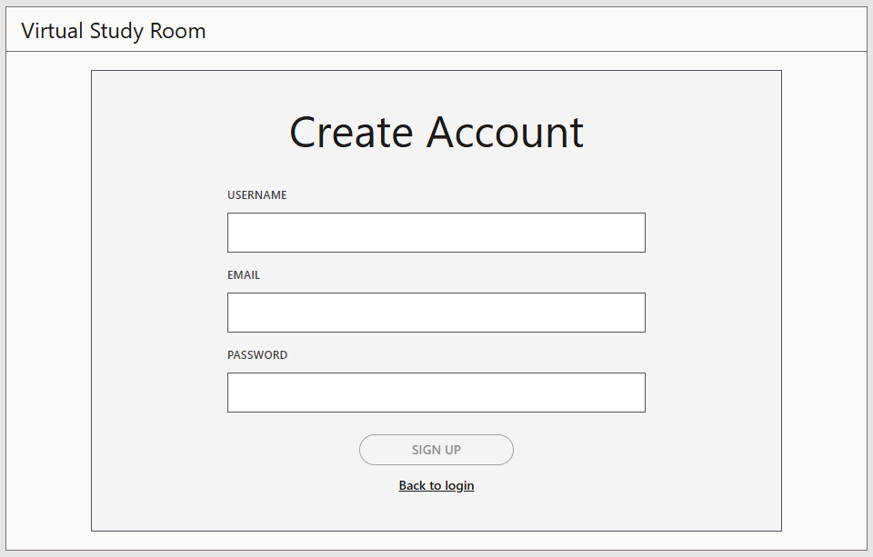

# Virtual Study Room

A full-stack collaborative study platform where students can create shared rooms, chat in real time, track tasks together, and stay on a synchronized Pomodoro timer, built end-to-end and deployed to Azure as my senior capstone project.

> **Live Application:** [https://wonderful-tree-02e36ee1e-preview.westus2.1.azurestaticapps.net](https://wonderful-tree-02e36ee1e-preview.westus2.1.azurestaticapps.net) <br>
> **Source Code:** [github.com/2tyger/CST451-452-VirtualStudyRoom](https://github.com/2tyger/CST451-452-VirtualStudyRoom)

---

## Table of Contents

- [Project Overview](#project-overview)
- [Why This Project Matters](#why-this-project-matters)
- [Key Features](#key-features)
- [Technology Stack](#technology-stack)
- [System Design](#system-design)
- [Implementation Approach](#implementation-approach)
- [Screenshots](#screenshots)
- [Code Highlights](#code-highlights)
- [Testing and Validation](#testing-and-validation)
- [Deployment and Access](#deployment-and-access)
- [Lessons Learned](#lessons-learned)
- [Future Improvements](#future-improvements)
- [Screencast](#screencast)

---

## Project Overview

Virtual Study Room is a full-stack web application that gives students a shared digital space to study together. Users create or join rooms, chat in real time, manage a shared task list, and run a Pomodoro timer that stays in sync for everyone in the room, deployed and running on Azure.

I built this across two semesters as my senior capstone at Grand Canyon University. CST-451 was design and architecture; CST-452 was full implementation, testing, cloud deployment, and production readiness.

---

## Why This Project Matters

Most productivity tools are built for individuals, and video call platforms were not designed for focused studying. Virtual Study Room fills that gap: a lightweight, purpose-built environment with a shared space, a shared clock, and shared goals.

From an engineering standpoint, the project required real-time state synchronization across concurrent clients, stateless authentication, cloud deployment, and enough observability to diagnose problems in production.

---

## Key Features

- **Room management**: create, join, leave, and delete rooms; OWNER / MEMBER role model enforced throughout
- **Real-time chat**: WebSocket (STOMP) chat with server-side content sanitization and per-user sliding-window rate limiting
- **Synchronized Pomodoro timer**: server holds authoritative timer state; a scheduled task auto-advances focus to break phases and broadcasts updates to all room members
- **Shared task board**: add, update, and toggle tasks; changes broadcast to all members in real time
- **Participant presence**: room membership events published over WebSocket so the member list updates live
- **Ambient music player**: optional per-user ambient audio with volume control and graceful browser autoplay handling
- **JWT authentication**: register, login, stateless session management via Bearer tokens
- **Profile management**: edit display name, email, bio, and password; credential changes force re-authentication
- **Observability**: MDC correlation ID on every HTTP request, Micrometer metrics on WebSocket traffic and event publish latency, Actuator `/health` and `/metrics` endpoints
- **Backup and recovery**: Azure PostgreSQL PITR enabled; logical restore validated with an actual recorded RTO of 6 minutes 38 seconds against a target of 15 minutes
- **CI**: separate GitHub Actions pipelines for backend (Java 17 / Maven) and frontend (Node 20 / ChromeHeadlessCI)

---

## Technology Stack

| Layer | Technology |
|---|---|
| **Frontend** | Angular 19, Tailwind CSS, STOMP.js |
| **Backend** | Spring Boot 3.5, Spring Security, Spring WebSocket (STOMP), Spring Data JPA |
| **Authentication** | JWT (JJWT 0.12.6), BCrypt |
| **Database** | PostgreSQL 16 hosted on Azure Database for PostgreSQL Flexible Server |
| **Observability** | Micrometer, Spring Boot Actuator, MDC correlation IDs |
| **Testing** | JUnit 5, Mockito, H2 (CI profile), Jasmine, Karma |
| **CI** | GitHub Actions |
| **Cloud** | Azure App Service (API), Azure Static Web Apps (frontend) |

---

## System Design

The app uses two communication channels: **REST** for request/response operations (auth, rooms, tasks, messages, timer commands) and **WebSocket (STOMP)** for real-time events.

The Angular SPA is deployed to Azure Static Web Apps. All API and WebSocket traffic routes to the Spring Boot backend on Azure App Service, which connects to the managed PostgreSQL Flexible Server over SSL.

### General Architecture Diagram



### ER Database Schema Diagram



Five tables: `users`, `rooms`, `room_members`, `tasks`, and `messages`. Timer state lives directly in the `rooms` table as `elapsed_seconds`, `is_running`, `start_time`, and `is_break_phase`; no separate timer table needed. This keeps read paths simple and the scheduled auto-advance logic straightforward.

### Process Flow Diagram



### UML Class Diagram



### API Summary

| Area | Method | Path |
|---|---|---|
| Auth | POST | `/api/auth/register`, `/api/auth/login` |
| Profile | GET / PUT | `/api/profile/me` |
| Rooms | GET / POST | `/api/rooms` |
| Room | GET / DELETE | `/api/rooms/{id}` |
| Membership | POST | `/api/rooms/{id}/join`, `/api/rooms/{id}/leave` |
| Tasks | GET / POST / PATCH / DELETE | `/api/rooms/{id}/tasks`, `/api/rooms/{id}/tasks/{taskId}` |
| Messages | GET / POST | `/api/rooms/{id}/messages` |
| Timer | POST | `/api/rooms/{id}/timer/start`, `/pause`, `/reset` |
| Actuator | GET | `/actuator/health`, `/actuator/metrics/{name}` |

**WebSocket:** connect at `/ws` (STOMP over SockJS), subscribe to `/topic/rooms/{roomId}` for `timer_update`, `task_update`, `chat_message`, and `room_membership_update` events, publish chat to `/app/rooms/{roomId}/chat.send`.

---

## Implementation Approach

**CST-451** was the full pre-development phase: project proposal, requirements gathering, architecture design, database schema, API contract, UML class diagrams, UI wireframes, other applicable diagrams, and a risk log. The design went through multiple revision cycles with documented milestone reviews. Three proof-of-concept items were validated before any production code was written: the server-authoritative timer approach, JWT expiration handling, and backup/restore feasibility.

To conclude CST-451, a short development phase was completed:

Development Phase I (end of October through early November) layed the initial groundwork for the application focusing on a simple button for practicing utilizing WebSocket and recording response times. Most of the development in this phase was rewritten come Development Phase II in CST-452.

**CST-452** was 10 sprints across multiple phases:

Development Phase II (February through mid-March) covered core feature implementation: authentication, room CRUD, WebSocket broker and STOMP auth interceptor, real-time chat and tasks, the server-authoritative timer with scheduled auto-advance, and rate limiting. The test suite and CI pipelines were built in parallel with the features.

Development Phase III (late March) focused on stabilization and production readiness: Azure deployment of all three services, observability additions (correlation IDs, Micrometer, Actuator), a chat view text rendering fix, the H2 context-load test that eliminated the external database dependency in CI, and the backup/recovery validation drill.

Final project completion (April) covered documentation refinement, milestone reporting, the screencast recording, this portfolio page, and final submission preparation.

---

## Screenshots

**Dashboard**



**Room (Perspective of Room Owner)**



**Profile**



**Login**



**Register**



---

## Code Highlights

### 1. Stateless JWT Authentication

Every protected request passes through `JwtAuthenticationFilter`. It extracts the Bearer token, validates the signature and expiration, and sets up the Spring Security context; no session storage involved.

```java
// JwtAuthenticationFilter.java (excerpt)
String token = header.substring(7);
String username = jwtService.extractSubject(token);
if (username != null
        && SecurityContextHolder.getContext().getAuthentication() == null
        && jwtService.isTokenValid(token)) {
    UserDetails userDetails = userDetailsService.loadUserByUsername(username);
    UsernamePasswordAuthenticationToken authToken =
            new UsernamePasswordAuthenticationToken(userDetails, null, userDetails.getAuthorities());
    authToken.setDetails(new WebAuthenticationDetailsSource().buildDetails(request));
    SecurityContextHolder.getContext().setAuthentication(authToken);
}
```

### 2. Server-Authoritative Timer

A `@Scheduled` task runs every second, checks all running rooms, and advances to the next phase when elapsed time hits the duration. The updated state is broadcast to the room's WebSocket topic so every connected client stays in sync without any client-side clock management.

```java
// TimerService.java (excerpt)
@Scheduled(fixedDelayString = "${app.pomodoro.auto-advance-ms:1000}")
public void autoAdvanceRunningTimers() {
    List<Room> runningRooms = roomRepository.findByRunningTrue();
    for (Room room : runningRooms) {
        long elapsed = computeElapsedSeconds(room);
        long duration = phaseDuration(room.isBreakPhase());
        if (elapsed < duration) continue;

        room.setBreakPhase(!room.isBreakPhase());
        room.setElapsedSeconds(0);
        room.setStartTime(Instant.now());
        Room saved = roomRepository.save(room);
        realtimeEventService.publishTimerUpdate(saved.getId(), toTimerState(saved));
    }
}
```

---

## Testing and Validation

### Backend

12 JUnit 5 test classes cover every service and the WebSocket layer: auth, registration, timer lifecycle, per-user rate limiting, chat content policy, room access control, task operations, message pagination, profile updates, WebSocket dispatch, and STOMP JWT authentication. Unit tests use Mockito; the context load test uses H2 so CI requires no external database.

### Frontend

Jasmine/Karma tests run headless via ChromeHeadlessCI, covering the room entry state machine, profile flows, auth guard routing, and HTTP service interactions.

### Reliability

- **Backup/restore drill**: `pg_dump` restore against the Azure PostgreSQL instance completed in **6 minutes 38 seconds**, well under the 15-minute RTO target
- **PITR**: Azure PostgreSQL Flexible Server PITR is enabled; RPO target of 1 day
- **CI**: both pipelines run on every push

---

## Deployment and Access

### Live

| | |
|---|---|
| **Frontend** | [https://wonderful-tree-02e36ee1e-preview.westus2.1.azurestaticapps.net](https://wonderful-tree-02e36ee1e-preview.westus2.1.azurestaticapps.net) |
| **Backend** | Azure App Service (HTTPS + WSS) |
| **Database** | Azure Database for PostgreSQL Flexible Server |

### Run Locally

**Prerequisites:** Java 17+, Node.js 20+, a local PostgreSQL database.

```bash
# Backend
cd virtualstudyroom
# In src/main/resources/application.properties, set:
#   spring.datasource.url / username / password  (local PostgreSQL)
#   app.jwt.secret  (any sufficiently long string)
./mvnw spring-boot:run
# API at http://localhost:8080
# WebSocket at ws://localhost:8080/ws

# Frontend
cd virtual-study-room-ui
npm install
# Update src/environments/environment.ts to point at localhost:8080
npm start
# App at http://localhost:4200
```

```bash
# Run all tests
cd virtualstudyroom && ./mvnw test
cd virtual-study-room-ui && npm test -- --watch=false --browsers=ChromeHeadless
```

---

## Lessons Learned

**Make the server authoritative from the start.** Timer state was always server-side, but getting phase transitions and pause/resume consistent across concurrent clients took more iteration than expected. I will say it is definitely worth thinking through the edge cases before writing the first lines.

**Add correlation IDs early.** The request logging filter was a late addition. Debugging earlier log output without them was much harder than it needed to be.

**Isolate tests from external dependencies.** Switching the backend context tests to an H2 profile removed an entire category of CI failures that had nothing to do with the code being tested. Worth doing upfront.

---

## Future Improvements

- **Task assignees**: assign tasks to specific room members (the schema column exists, the view layer is not wired up yet)
- **Timer presets**: configurable focus and break durations per room
- **Room invitation links**: shareable join links instead of manual room discovery
- **Session analytics**: task completion rates and session duration history per room
- **Mobile layout**: Tailwind is already in the stack; the room screen needs a responsive breakpoint pass

---

## Screencast

[](https://www.youtube.com/watch?v=dzhfWku68co)

### If the above frame fails to redirect, click here: [demo video](https://www.youtube.com/watch?v=dzhfWku68co).


This demo provides an overview of the application in use, as well as other informative topics in relation to the development of this application.

---

*Designed and Developed by Ty Gilbert; CST-451 / CST-452 Senior Capstone Project - Virtual Study Room, 2025-2026 Grand Canyon University (GCU).*
